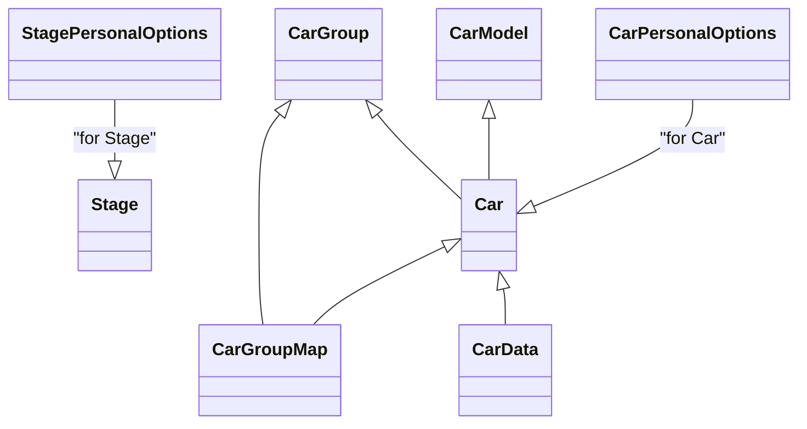

# RBR Domain Model Documentation

This document describes the domain model extracted from the JSON and INI files in `data/rbr.samples/`. It includes a Mermaid class diagram showing the models and their relationships, and a detailed table for each model with field name, type, description, and source file.

---

## Mermaid Class Diagram

- **CarGroupMap** links **CarGroup** and **Car**.
- **Car** references **CarModel** and **CarGroup**.
- **CarData** references **Car**.
- **CarPersonalOptions** is associated with **Car**.
- **StagePersonalOptions** is associated with **Stage**.

---

## Entities and Fields

### CarGroup (`data/rbr.samples/cargroups.json`)

| Field      | Type   | Example | Description                                 | Source File                        |
|------------|--------|---------|---------------------------------------------|------------------------------------|
| id         | int    | 7       | Unique identifier for the car group         | cargroups.json                     |
| name       | string | "All"   | Name of the car group                       | cargroups.json                     |
| user_id    | int    | 335     | User identifier (creator/owner)             | cargroups.json                     |
| main       | int    | 1       | Main group flag or reference                | cargroups.json                     |
| test       | int    | 0       | Test group flag or reference                | cargroups.json                     |
| ngp        | int    | 6       | NGP version or group version                | cargroups.json                     |

---

### CarModel (`data/rbr.samples/carmodels.json`)

| Field    | Type   | Example | Description                                 | Source File                        |
|----------|--------|---------|---------------------------------------------|------------------------------------|
| id       | int    | 253     | Unique identifier for the car model         | carmodels.json                     |
| name     | string | "Abarth Grande Punto S2000" | Name of the car model           | carmodels.json                     |
| path     | string | "g.punto_s2000" | Filesystem path for the car model     | carmodels.json                     |
| filename | string | "g.punto_s2000" | Filename for the car model            | carmodels.json                     |
| hash     | string | "7ad65666fb09c35e3d6e7f2e361c7c9e" | Hash for the car model file | carmodels.json                     |
| fallback | int    | 5       | Fallback model reference                    | carmodels.json                     |

---

### Car (`data/rbr.samples/cars.json`)

| Field          | Type   | Example | Description                                         | Source File    |
|----------------|--------|---------|-----------------------------------------------------|----------------|
| id             | int    | 91      | Unique identifier for the car                       | cars.json      |
| name           | string | "Abarth Grande Punto S2000" | Name of the car             | cars.json      |
| path           | string | "Abarth_Grande_Punto_S2000_ngp6" | Filesystem path for the car | cars.json      |
| hash           | string | "ce111bc509c092317e8855d83bfffe13" | Hash for the car file     | cars.json      |
| carmodel_id    | int    | 253     | Reference to CarModel.id                            | cars.json      |
| user_id        | int    | 335     | User identifier (creator/owner)                     | cars.json      |
| base_group_id  | int    | 111     | Reference to CarGroup.id                            | cars.json      |
| test           | int    | 0       | Test car flag or reference                          | cars.json      |
| ngp            | int    | 6       | NGP version or car version                          | cars.json      |
| custom_setups  | string | "d41d8cd98f00b204e9800998ecf8427e" | Hash or reference for custom setups | cars.json      |
| rev            | string | "1 / 2021-11-03" | Revision/version info                             | cars.json      |
| audio          | string (nullable) | null or "Aston_Vantage_RGT" | Audio file or reference (nullable) | cars.json      |
| audio_hash     | string | "" or "36d8f91bcd30dfc611ab45aa502cc32b" | Hash for the audio file | cars.json      |

---

### CarData (`data/rbr.samples/cars_data.json`)

| Field            | Type   | Example | Description                                         | Source File      |
|------------------|--------|---------|-----------------------------------------------------|------------------|
| car_id           | int    | 17      | Reference to Car.id                                 | cars_data.json   |
| power            | string | "55bhp / 6500rpm" | Engine power (e.g., "55bhp / 6500rpm")              | cars_data.json   |
| torque           | string | "65Nm / 5500rpm" | Engine torque (e.g., "65Nm / 5500rpm")              | cars_data.json   |
| drive_train      | string | "RWD"   | Drive train type (e.g., "RWD", "AWD")               | cars_data.json   |
| engine           | string | ""      | Engine details or reference                         | cars_data.json   |
| transmission     | string | "4 gears" | Transmission details (e.g., "4 gears")              | cars_data.json   |
| weight           | string | "729kg" | Car weight (e.g., "729kg")                          | cars_data.json   |
| wdf              | string | "44%"   | Weight distribution front (%)                       | cars_data.json   |
| steering_wheel   | int    | 835     | Steering wheel rotation (degrees)                   | cars_data.json   |
| skin             | string | ""      | Skin or livery reference                            | cars_data.json   |
| model            | string | "Fiat 126 version 1.2.6 2015-07-19 Frito Fixes by WorkerBee" | Model details or version info | cars_data.json   |
| audio            | string | "aesthetic_sofa (Lorenzo), JJBruce" | Audio file or reference                             | cars_data.json   |
| year             | int    | 1977    | Model year                                          | cars_data.json   |
| shifterType      | string | "H-pattern" | Shifter type (e.g., "H-pattern")                    | cars_data.json   |
| id               | int    | 17      | Unique identifier for the car data                  | cars_data.json   |

---

### CarGroupMap (`data/rbr.samples/car_group_map.json`)

| Field    | Type   | Example | Description                                 | Source File            |
|----------|--------|---------|---------------------------------------------|------------------------|
| group_id | int    | 111     | Reference to CarGroup.id                    | car_group_map.json     |
| car_id   | int    | 91      | Reference to Car.id                         | car_group_map.json     |
| id       | int    | 91      | Unique identifier for the mapping           | car_group_map.json     |
| name     | string | "Abarth Grande Punto S2000" | Name of the car in the group                | car_group_map.json     |
| ngp      | int    | 6       | NGP version or mapping version              | car_group_map.json     |

---

### Stage (`data/rbr.samples/stages_data.json`)

| Field              | Type   | Example | Description                                         | Source File          |
|--------------------|--------|---------|-----------------------------------------------------|----------------------|
| id                 | int    | 10      | Unique identifier for the stage                     | stages_data.json     |
| name               | string | "Kaihuavaara" | Name of the stage                                   | stages_data.json     |
| deftime            | int    | 255     | Default time (seconds)                              | stages_data.json     |
| length             | int    | 6100    | Stage length (meters)                               | stages_data.json     |
| surface_id         | int    | 3       | Surface type identifier                             | stages_data.json     |
| stage_id           | int    | 10      | Stage identifier (may duplicate id)                 | stages_data.json     |
| short_country      | string | "FI"    | Country code (e.g., "FI")                           | stages_data.json     |
| author             | string | "Warthog Games" | Author of the stage                                 | stages_data.json     |
| tarmac             | int    | 0       | Tarmac percentage                                   | stages_data.json     |
| gravel             | int    | 0       | Gravel percentage                                   | stages_data.json     |
| snow               | int    | 100     | Snow percentage                                     | stages_data.json     |
| new_update         | int    | 0       | New update flag                                     | stages_data.json     |
| author_web         | string | ""      | Author's website                                    | stages_data.json     |
| author_note        | string | ""      | Author's note                                       | stages_data.json     |
| fattrib            | null   | null    | Additional attributes (nullable)                    | stages_data.json     |

---

### CarPersonalOptions (`data/rbr.samples/rallysimfans_personal.ini`, [carX] sections)

| Field                        | Type    | Example | Description                                             | Source File                      |
|------------------------------|---------|---------|---------------------------------------------------------|----------------------------------|
| name                         | string  | "VW Polo R WRC 2016" | Name of the car                                         | rallysimfans_personal.ini        |
| rbrvr_seat0                  | string (CSV float) | "-0.001280,0.102880,0.039360" | VR seat position 0 (comma-separated floats)             | rallysimfans_personal.ini        |
| rbrvr_seat1                  | string (CSV float) | "0.328431,0.295067,-0.094426" | VR seat position 1 (comma-separated floats)             | rallysimfans_personal.ini        |
| rbrvr_seat2                  | string (CSV float) | "0.003676,0.256583,0.022752" | VR seat position 2 (comma-separated floats)             | rallysimfans_personal.ini        |
| fulldashposition_2d          | string  | ""      | 2D dashboard position                                   | rallysimfans_personal.ini        |
| fulldashposition_vr          | string (space-separated int) | "528 711" | VR dashboard position                                   | rallysimfans_personal.ini        |
| fmod_mastervolume            | int     | 2       | FMOD master volume                                      | rallysimfans_personal.ini        |
| setuptarmac                  | string  | ""      | Tarmac setup file or reference                          | rallysimfans_personal.ini        |
| setupgravel                  | string  | ""      | Gravel setup file or reference                          | rallysimfans_personal.ini        |
| setupsnow                    | string  | ""      | Snow setup file or reference                            | rallysimfans_personal.ini        |
| mirroredsteeringwheel        | boolean | 0       | Mirrored steering wheel flag (0/1)                      | rallysimfans_personal.ini        |
| steeringrotation             | string  | ""      | Steering rotation (degrees)                             | rallysimfans_personal.ini        |
| forcefeedbacksensitivitytarmac | int  | 2079    | Force feedback sensitivity for tarmac                   | rallysimfans_personal.ini        |
| forcefeedbacksensitivitygravel | int  | 2079    | Force feedback sensitivity for gravel                   | rallysimfans_personal.ini        |
| forcefeedbacksensitivitysnow   | int  | 2079    | Force feedback sensitivity for snow                     | rallysimfans_personal.ini        |

---

### StagePersonalOptions (`data/rbr.samples/rallysimfans_personal.ini`, [stageX] sections)

| Field                        | Type    | Example | Description                                             | Source File                      |
|------------------------------|---------|---------|---------------------------------------------------------|----------------------------------|
| name                         | string  | "Rally School lessons" | Name of the stage                                       | rallysimfans_personal.ini        |
| renderquality                | string  | ""      | Render quality setting                                  | rallysimfans_personal.ini        |
| renderquality_replay         | string  | ""      | Render quality for replay                               | rallysimfans_personal.ini        |
| particlequality              | string  | ""      | Particle quality setting                                | rallysimfans_personal.ini        |
| particlequality_replay       | string  | ""      | Particle quality for replay                             | rallysimfans_personal.ini        |
| rendercarshadow              | string  | ""      | Car shadow rendering setting                            | rallysimfans_personal.ini        |
| rendercarshadow_replay       | string  | ""      | Car shadow rendering for replay                         | rallysimfans_personal.ini        |
| usecubicenvironmentmaps      | string  | ""      | Use cubic environment maps flag                         | rallysimfans_personal.ini        |
| usecubicenvironmentmaps_replay | string | ""      | Use cubic environment maps for replay                   | rallysimfans_personal.ini        |

---

This documentation provides a high-level overview of the RBR domain model, its entities, their fields, types, descriptions, and relationships, with each field referencing its source file for traceability.