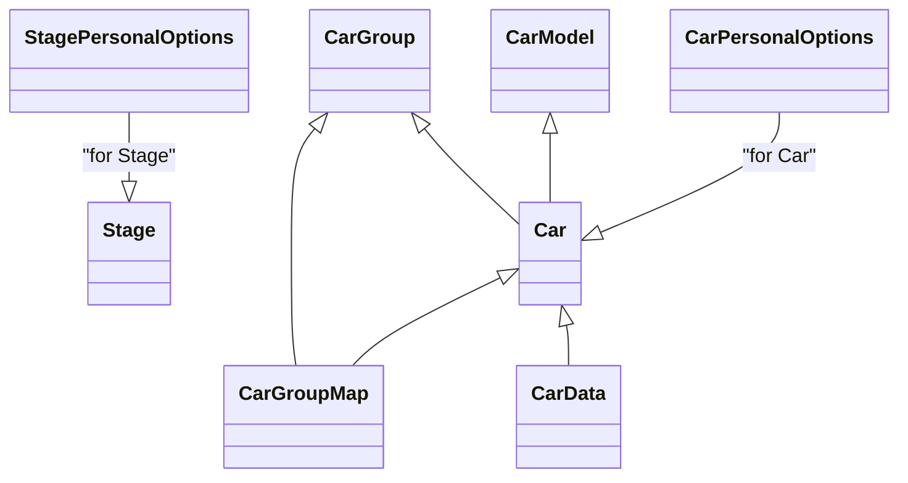

# RBR Domain Model Documentation

This document describes the domain model extracted from the JSON and INI files in `data/rbr.samples/`. It includes a Mermaid class diagram showing the models and their relationships, and a detailed table for each model with field name, type, description, and source file.

---

## Mermaid Class Diagram

- **CarGroupMap** links **CarGroup** and **Car**.
- **Car** references **CarModel** and **CarGroup**.
- **CarData** references **Car**.
- **CarPersonalOptions** is associated with **Car**.
- **StagePersonalOptions** is associated with **Stage**.

---

## Entities and Fields

### CarGroup (`data/rbr.samples/cargroups.json`)

| Field      | Type   | Description                                 | Source File                        |
|------------|--------|---------------------------------------------|------------------------------------|
| id         | string | Unique identifier for the car group         | cargroups.json                     |
| name       | string | Name of the car group                       | cargroups.json                     |
| user_id    | string | User identifier (creator/owner)             | cargroups.json                     |
| main       | string | Main group flag or reference                | cargroups.json                     |
| test       | string | Test group flag or reference                | cargroups.json                     |
| ngp        | string | NGP version or group version                | cargroups.json                     |

---

### CarModel (`data/rbr.samples/carmodels.json`)

| Field    | Type   | Description                                 | Source File                        |
|----------|--------|---------------------------------------------|------------------------------------|
| id       | string | Unique identifier for the car model         | carmodels.json                     |
| name     | string | Name of the car model                       | carmodels.json                     |
| path     | string | Filesystem path for the car model           | carmodels.json                     |
| filename | string | Filename for the car model                  | carmodels.json                     |
| hash     | string | Hash for the car model file                 | carmodels.json                     |
| fallback | string | Fallback model reference                    | carmodels.json                     |

---

### Car (`data/rbr.samples/cars.json`)

| Field          | Type   | Description                                         | Source File    |
|----------------|--------|-----------------------------------------------------|----------------|
| id             | string | Unique identifier for the car                       | cars.json      |
| name           | string | Name of the car                                     | cars.json      |
| path           | string | Filesystem path for the car                         | cars.json      |
| hash           | string | Hash for the car file                               | cars.json      |
| carmodel_id    | string | Reference to CarModel.id                            | cars.json      |
| user_id        | string | User identifier (creator/owner)                     | cars.json      |
| base_group_id  | string | Reference to CarGroup.id                            | cars.json      |
| test           | string | Test car flag or reference                          | cars.json      |
| ngp            | string | NGP version or car version                          | cars.json      |
| custom_setups  | string | Hash or reference for custom setups                 | cars.json      |
| rev            | string | Revision/version info                               | cars.json      |
| audio          | string | Audio file or reference (nullable)                  | cars.json      |
| audio_hash     | string | Hash for the audio file                             | cars.json      |

---

### CarData (`data/rbr.samples/cars_data.json`)

| Field            | Type   | Description                                         | Source File      |
|------------------|--------|-----------------------------------------------------|------------------|
| car_id           | string | Reference to Car.id                                 | cars_data.json   |
| power            | string | Engine power (e.g., "55bhp / 6500rpm")              | cars_data.json   |
| torque           | string | Engine torque (e.g., "65Nm / 5500rpm")              | cars_data.json   |
| drive_train      | string | Drive train type (e.g., "RWD", "AWD")               | cars_data.json   |
| engine           | string | Engine details or reference                         | cars_data.json   |
| transmission     | string | Transmission details (e.g., "4 gears")              | cars_data.json   |
| weight           | string | Car weight (e.g., "729kg")                          | cars_data.json   |
| wdf              | string | Weight distribution front (%)                       | cars_data.json   |
| steering_wheel   | string | Steering wheel rotation (degrees)                   | cars_data.json   |
| skin             | string | Skin or livery reference                            | cars_data.json   |
| model            | string | Model details or version info                       | cars_data.json   |
| audio            | string | Audio file or reference                             | cars_data.json   |
| year             | string | Model year                                          | cars_data.json   |
| shifterType      | string | Shifter type (e.g., "H-pattern")                    | cars_data.json   |
| id               | string | Unique identifier for the car data                  | cars_data.json   |

---

### CarGroupMap (`data/rbr.samples/car_group_map.json`)

| Field    | Type   | Description                                 | Source File            |
|----------|--------|---------------------------------------------|------------------------|
| group_id | string | Reference to CarGroup.id                    | car_group_map.json     |
| car_id   | string | Reference to Car.id                         | car_group_map.json     |
| id       | string | Unique identifier for the mapping           | car_group_map.json     |
| name     | string | Name of the car in the group                | car_group_map.json     |
| ngp      | string | NGP version or mapping version              | car_group_map.json     |

---

### Stage (`data/rbr.samples/stages_data.json`)

| Field              | Type   | Description                                         | Source File          |
|--------------------|--------|-----------------------------------------------------|----------------------|
| id                 | string | Unique identifier for the stage                     | stages_data.json     |
| name               | string | Name of the stage                                   | stages_data.json     |
| deftime            | string | Default time (seconds)                              | stages_data.json     |
| length             | string | Stage length (meters)                               | stages_data.json     |
| surface_id         | string | Surface type identifier                             | stages_data.json     |
| stage_id           | string | Stage identifier (may duplicate id)                 | stages_data.json     |
| short_country      | string | Country code (e.g., "FI")                           | stages_data.json     |
| author             | string | Author of the stage                                 | stages_data.json     |
| tarmac             | string | Tarmac percentage                                   | stages_data.json     |
| gravel             | string | Gravel percentage                                   | stages_data.json     |
| snow               | string | Snow percentage                                     | stages_data.json     |
| new_update         | string | New update flag                                     | stages_data.json     |
| author_web         | string | Author's website                                    | stages_data.json     |
| author_note        | string | Author's note                                       | stages_data.json     |
| fattrib            | string | Additional attributes (nullable)                    | stages_data.json     |

---

### CarPersonalOptions (`data/rbr.samples/rallysimfans_personal.ini`, [carX] sections)

| Field                        | Type    | Description                                             | Source File                      |
|------------------------------|---------|---------------------------------------------------------|----------------------------------|
| name                         | string  | Name of the car                                         | rallysimfans_personal.ini        |
| rbrvr_seat0                  | string  | VR seat position 0 (comma-separated floats)             | rallysimfans_personal.ini        |
| rbrvr_seat1                  | string  | VR seat position 1 (comma-separated floats)             | rallysimfans_personal.ini        |
| rbrvr_seat2                  | string  | VR seat position 2 (comma-separated floats)             | rallysimfans_personal.ini        |
| fulldashposition_2d          | string  | 2D dashboard position                                   | rallysimfans_personal.ini        |
| fulldashposition_vr          | string  | VR dashboard position                                   | rallysimfans_personal.ini        |
| fmod_mastervolume            | number  | FMOD master volume                                      | rallysimfans_personal.ini        |
| setuptarmac                  | string  | Tarmac setup file or reference                          | rallysimfans_personal.ini        |
| setupgravel                  | string  | Gravel setup file or reference                          | rallysimfans_personal.ini        |
| setupsnow                    | string  | Snow setup file or reference                            | rallysimfans_personal.ini        |
| mirroredsteeringwheel        | boolean | Mirrored steering wheel flag (0/1)                      | rallysimfans_personal.ini        |
| steeringrotation             | string  | Steering rotation (degrees)                             | rallysimfans_personal.ini        |
| forcefeedbacksensitivitytarmac | number | Force feedback sensitivity for tarmac                   | rallysimfans_personal.ini        |
| forcefeedbacksensitivitygravel | number | Force feedback sensitivity for gravel                   | rallysimfans_personal.ini        |
| forcefeedbacksensitivitysnow   | number | Force feedback sensitivity for snow                     | rallysimfans_personal.ini        |

---

### StagePersonalOptions (`data/rbr.samples/rallysimfans_personal.ini`, [stageX] sections)

| Field                        | Type    | Description                                             | Source File                      |
|------------------------------|---------|---------------------------------------------------------|----------------------------------|
| name                         | string  | Name of the stage                                       | rallysimfans_personal.ini        |
| renderquality                | string  | Render quality setting                                  | rallysimfans_personal.ini        |
| renderquality_replay         | string  | Render quality for replay                               | rallysimfans_personal.ini        |
| particlequality              | string  | Particle quality setting                                | rallysimfans_personal.ini        |
| particlequality_replay       | string  | Particle quality for replay                             | rallysimfans_personal.ini        |
| rendercarshadow              | string  | Car shadow rendering setting                            | rallysimfans_personal.ini        |
| rendercarshadow_replay       | string  | Car shadow rendering for replay                         | rallysimfans_personal.ini        |
| usecubicenvironmentmaps      | string  | Use cubic environment maps flag                         | rallysimfans_personal.ini        |
| usecubicenvironmentmaps_replay | string | Use cubic environment maps for replay                   | rallysimfans_personal.ini        |

---

This documentation provides a high-level overview of the RBR domain model, its entities, their fields, types, descriptions, and relationships, with each field referencing its source file for traceability.